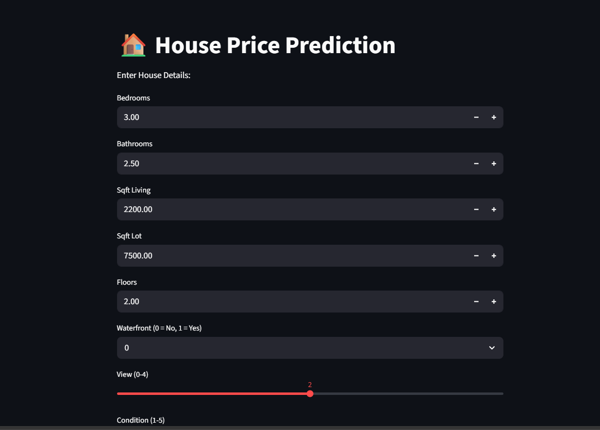
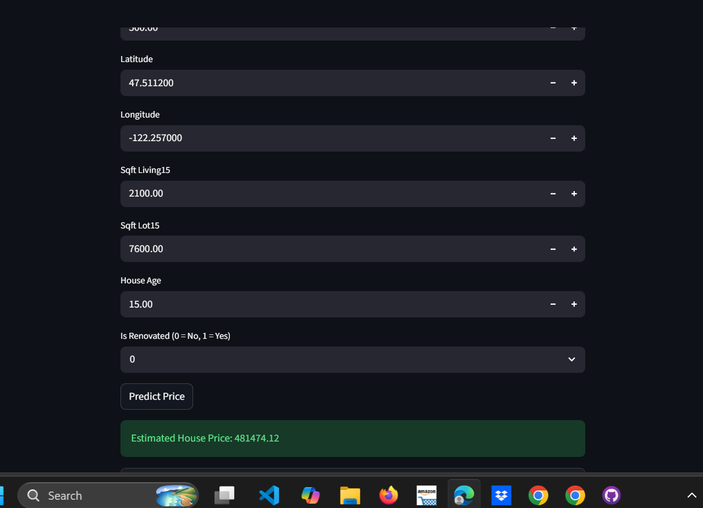

# 🏠 House Price Prediction using Machine Learning


## 📖 Overview

House Price Prediction is a Machine Learning web application developed using Streamlit. The application predicts the estimated price of a house based on various property features entered by the user.

This project demonstrates the complete machine learning workflow, including data preprocessing, feature engineering, model training, evaluation, model comparison, and deployment through an interactive Streamlit web application.

---

## ✨ Features

* 🏠 Predict house prices based on property details
* 📊 Interactive Streamlit user interface
* 🤖 Machine Learning model integration
* ⚡ Real-time prediction
* 📈 End-to-end ML workflow demonstration
* 💾 Trained model deployment using Pickle

---

## 🛠️ Technologies Used

### Programming

* Python

### Web Framework

* Streamlit

### Machine Learning

* Scikit-learn
* XGBoost
* Pickle

### Libraries

* NumPy
* Pandas

---

## 🤖 Machine Learning Workflow

### Data Preparation

* Data Cleaning
* Missing Value Analysis
* Duplicate Value Checking
* Feature Engineering
* Data Preprocessing
* Feature Scaling
* Train-Test Split

### Models Evaluated

* Linear Regression
* Ridge Regression
* Random Forest Regressor
* Tuned Random Forest Regressor
* XGBoost Regressor

### Model Evaluation Metrics

* Mean Absolute Error (MAE)
* Mean Squared Error (MSE)
* Root Mean Squared Error (RMSE)
* Mean Absolute Percentage Error (MAPE)
* R² Score

After comparing the performance of multiple regression models, the final trained model was saved using Pickle and deployed through a Streamlit web application for real-time house price prediction.

---

## 📂 Project Structure

```text
house-price-prediction/
│
├── app.py
├── house_price_model.pkl
├── miniproject.ipynb
├── README.md
├── requirements.txt
├── screenshots/
```

---

## 🚀 Installation

```bash
git clone https://github.com/sarpitha-05/house-Price-Prediction.git

cd house-Price-Prediction

pip install -r requirements.txt

streamlit run app.py
```

---

## 📸 Application Screenshots

### 📊 Prediction Page



### 💰 Prediction Result



---

## 🔮 Future Enhancements

* Improved User Interface
* Advanced Feature Selection
* Hyperparameter Optimization
* Model Performance Dashboard
* Cloud Deployment
* Interactive Data Visualization

---

## 👩‍💻 Author

**Arpitha S**

Bachelor of Computer Applications (BCA)

Python & Machine Learning Enthusiast

---

## 📜 License

This project is developed for educational and learning purposes.
